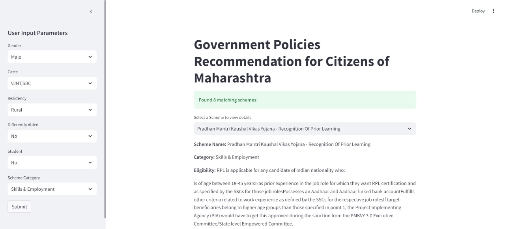

# Government Policies Recommendation App

This is an AI-driven web application designed to help citizens of Maharashtra navigate government policies and welfare schemes. The app provides personalized recommendations based on user-specific information such as age, gender, caste, income, and residency.

## Features

- **Personalized Recommendations**: Users can filter schemes based on various parameters like gender, caste, residency, scheme category and student status.
- **Chatbot Integration**: Ask questions about specific policies and receive detailed answers generated by an AI model.
- **Real-time Updates**: The application is designed to be updated regularly with new government schemes and policy changes.
- **User-Friendly Interface**: Built with Streamlit for a smooth user experience.

## Screenshots


*Main Interface: Users can input their parameters to get personalized scheme recommendations.*


*Scheme Details: Displays information about the selected scheme.*


*Chatbot Interaction: Ask questions related to specific policies.*

## Technologies Used

- Python
- Streamlit
- Pandas
- Groq API for AI-based interactions
- Python-dotenv for managing environment variables

## Prerequisites

Make sure you have Python installed (preferably version 3.7 or higher). You can download it from [python.org](https://www.python.org/).

## Installation

1. Clone the repository:

   ```bash
   git clone https://github.com/yashkadam435/Government-Schemes-Recommendation-Final-Project.git
   cd Government-Schemes-Recommendation-Final-Project
   ```
2. Install the required packages:

    ```bash
    pip install -r requirements.txt
    ```
3. Create a .env file in the root directory and add your Groq API key:
   
    ```bash
    GROQ_API_KEY=your_groq_api_key_here
    ```
4. Download the Government_Schemes_Dataset.csv and place it in the root directory of the project.

## Usage

Run the Streamlit app with the following command:

    ```bash
    streamlit run app.py
    ```
Open your web browser and navigate to http://localhost:8501 to access the application.

## Contributing

Contributions are welcome! If you have suggestions for improvements or want to add features, please open an issue or submit a pull request.

## License

This project is licensed under the MIT License. See the LICENSE file for details.
